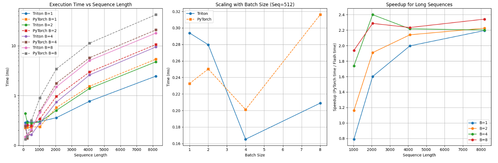

# Triton Flash Attention vs PyTorch Standard Attention
This repository implements Flash Attention using Triton and benchmarks it against standard PyTorch attention mechanisms. The implementation demonstrates significant speedups for longer sequences and larger batch sizes.


## Key Findings
Our benchmark results show:

### Performance Crossover: Triton Flash Attention outperforms PyTorch at:

- Batch size 1: ≥ 2048 tokens
- Batch size 2: ≥ 1024 tokens
- Batch size 4 & 8: ≥ 512 tokens


### Speedup by Sequence Length:

- Short sequences (128-256): No advantage (0.79-0.88x)
- Medium sequences (512-1024): Modest speedup (1.10-1.41x)
- Long sequences (2048-8192): Significant speedup (2.05-2.24x)


### Best Performance: 
2.4x speedup at batch size 4, sequence length 2048

### Average Speedups by Batch Size:

- Batch 1: 1.27x
- Batch 2: 1.40x
- Batch 4: 1.66x
- Batch 8: 1.74x


### Numerical Stability: 
Maximum difference between implementations is very small (0.00001)

## Implementation Components

`TritonFlashAttention`: Main PyTorch module with Triton-optimized attention
`StandardAttention`: Reference PyTorch implementation
`fwd_kernel`: Triton kernel for Flash Attention algorithm
`flash_attention_forward`: Interface between PyTorch and Triton

## Installation Requirements
```
torch>=1.10.0
triton>=2.0.0
matplotlib
numpy
```

An NVIDIA GPU with CUDA support is required to run the Triton kernels.


## Performance Visualization

The following plot shows the performance comparison between Triton Flash Attention and standard PyTorch attention:



The visualization includes three key insights:
1. **Execution Time vs Sequence Length** (left): Shows how both implementations scale with increasing sequence length across different batch sizes, with Triton showing better scaling for longer sequences.
2. **Scaling with Batch Size** (middle): Demonstrates how performance changes when increasing batch size for a fixed sequence length of 512 tokens.
3. **Speedup for Long Sequences** (right): Highlights the acceleration factor (PyTorch time / Triton time) achieved for sequences over 1024 tokens, showing consistent gains of 2.0-2.4x for longer sequences.

This plot confirms that Triton Flash Attention provides significant performance benefits for longer sequences.

## When to Use Which Implementation

### Use Triton Flash Attention when:

- Processing sequences longer than 1024 tokens
- Working with larger batch sizes (≥ 4)
- GPU memory is limited and you need to process long sequences


### Use PyTorch Standard Attention when:

- Processing short sequences (< 512 tokens)
- Using small batch sizes (1-2)
- Rapid prototyping where implementation simplicity is preferred


## Technical Details

### Optimization Techniques
The Triton implementation uses several key optimizations:

1. Tiling: Processing blocks of queries, keys, and values to maximize GPU cache utilization
2. Fused operations: Combining multiple steps into a single kernel pass
3. Numerical stability: Using the log-sum-exp trick for softmax computation
4. Memory efficiency: Computing attention scores on-the-fly without materializing the full attention matrix

## Scaling Analysis

**Batch size 1:**

- 4096/2048: Triton 2.14x vs PyTorch 2.70x
- 8192/4096: Triton 3.19x vs PyTorch 3.51x


**Batch size 8:**

- 4096/2048: Triton 3.37x vs PyTorch 3.30x
- 8192/4096: Triton 3.56x vs PyTorch 3.73x


This demonstrates that Triton Flash Attention generally scales better with increasing sequence length, particularly at higher batch sizes.


## Future Work

- Add causal masking 
- Implement backward pass in Triton for end-to-end training
- Optimize for mixed precision (FP16/BF16)

## Acknowledgements

This implementation is inspired by:
The original Flash Attention paper (Dao et al.)
